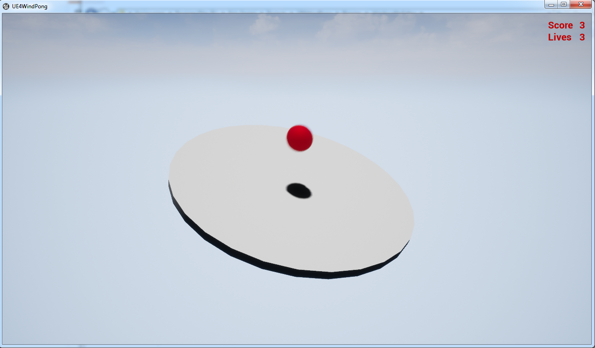
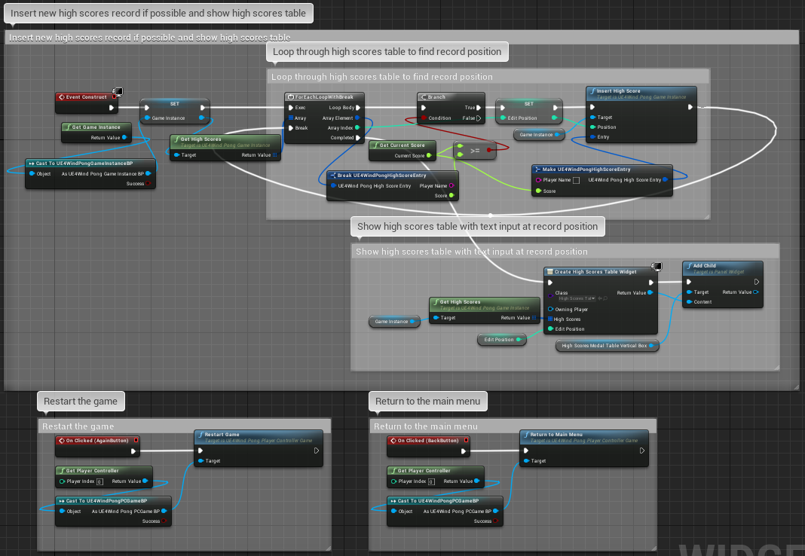

# UE4WindPong

Unreal Engine 4 demo wind pong game.

## Description

_UE4WindPong_ is a demo game made using Unreal Engine. The goal is to repulse the ball with the pad as much as you can while fighting the wind.
Game utilizes save game object for high scores (stored in user directory in \AppData\Local\UE4WindPong\Saved\SaveGames\highscores.sav).
Most of the work done in code, blueprints are used only for interface (you can check them in [Docs](Docs/) directory).

## Building

Built with Unreal Engine 4.17.2 using Microsoft Visual Studio Community 2017 (but 2015 should be enough).

## Installation

Not required.

## Usage

To test chat just launch the game. The pad is controlled by arrows keys or WASD.
After losing all lives input the name and press Enter to save high scores.
